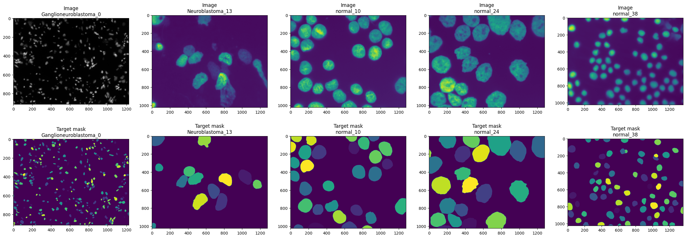
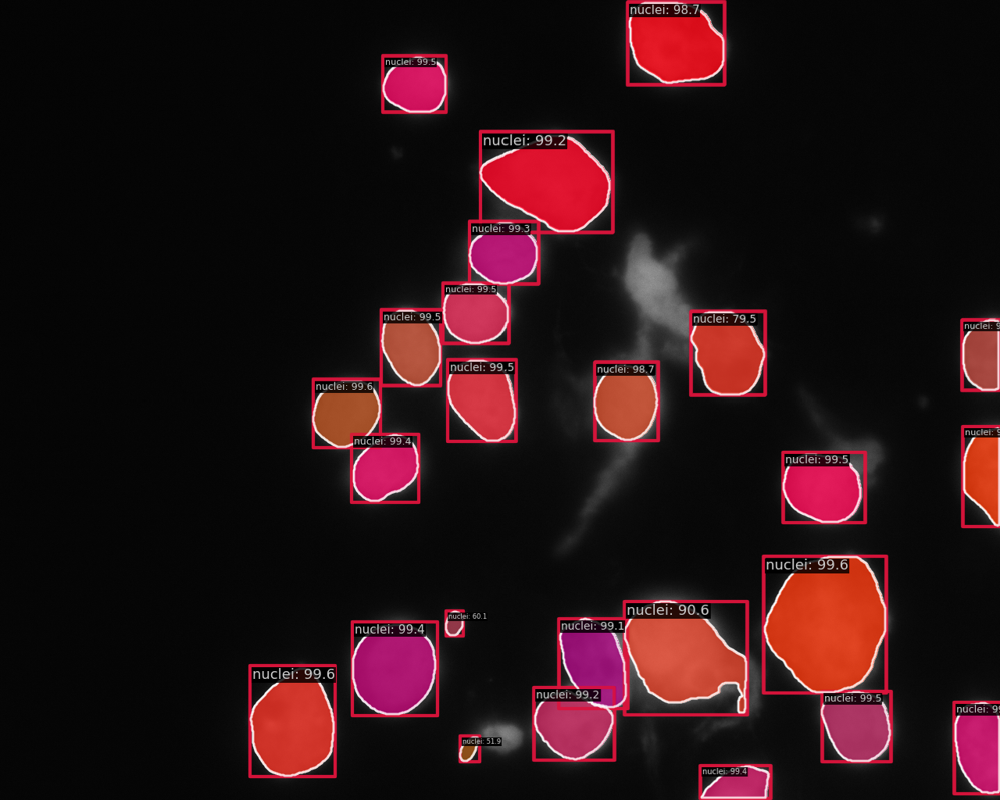

# dl-cell-nuclei-segmentation

## Overview

### Team:
Piotr Słowik, Grzegorz Maliniak
### Description:
Cell nuclei segmentation with Mask R-CNN
### Dataset:
Fluorescence Image Dataset: https://www.ebi.ac.uk/biostudies/bioimages/studies/S-BSST265


## How to use

1. Download the repository by cloning it or downloading the ZIP file and extract it to a folder of your choice. Open terminal in repos folder.

2. Create a virtual environment and activate it. This can be done by running the following commands in the terminal:
```
python -m venv env
source env/bin/activate
```

3. Install the project dependencies by running the following command in the terminal:
```
pip install -r src/requirements.txt
```

4. Download the dataset into the data directory and download pretrained model by running the following commands in the terminal:
'''
dvc pull
mkdir checkpoints
wget -c https://download.openmmlab.com/mmdetection/v2.0/mask_rcnn/mask_rcnn_r50_caffe_fpn_mstrain-poly_3x_coco/mask_rcnn_r50_caffe_fpn_mstrain-poly_3x_coco_bbox_mAP-0.408__segm_mAP-0.37_20200504_163245-42aa3d00.pth \
      -O checkpoints/mask_rcnn_r50_caffe_fpn_mstrain-poly_3x_coco_bbox_mAP-0.408__segm_mAP-0.37_20200504_163245-42aa3d00.pth
'''

5. Preprocess the images and create a Torch DataLoader for the dataset by running the following command in the terminal:
```
kedro run --pipeline='data_loader'
```
This command will also split the data into training and testing datasets and create training weights.

6. Create the Mask R-CNN model by running the following command in the terminal:

```
kedro run --pipeline='mask_rcnn_setup'
```

8. Train the Mask R-CNN model. The trained model will be saved inside Kedro.

```
kedro run --pipeline='model_train'
```

9. Evaluate the Mask R-CNN model and check it's performance.

```
kedro run --pipeline='model_eval'
```

10. To create documentation, use the following command in the terminal:
```
kedro build-docs
```

Extras. Sample results:




### Short version

1. Download the repository by cloning it or downloading the ZIP file and extract it to a folder of your choice. Open terminal in repos folder.

2. Type in terminal:

```
python -m venv env
source env/bin/activate
pip install -r src/requirements.txt
dvc pull
kedro run
```
